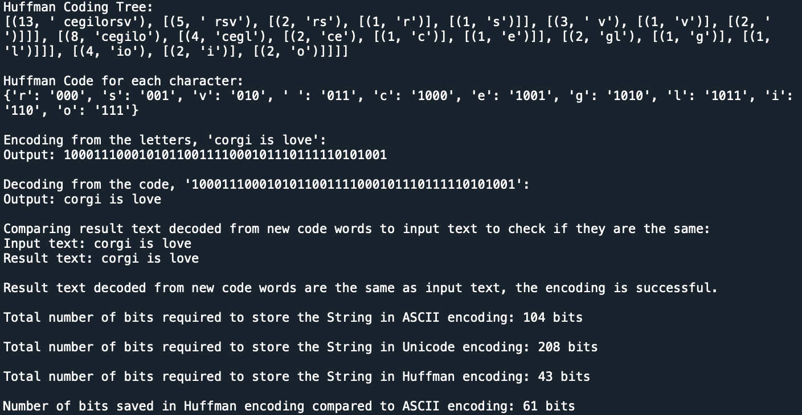

# HuffmanPY
A simulation of Huffman Coding Algorithm performed on a String built using Python.

## Running the algorithm
- Run main.py using any Python IDE.  
- Edit the variable input_text to perform Huffman Coding algorithm on a different String.

## Problem Description
This is a simulation I created to simulate the process of Huffman Coding algorithm which stores a String in Huffman encoding. Huffman Coding is a method used for data compression. In Huffman Coding, a new set of binary bits pattern used to store the data in bits are generated to reduce the amount of bits needed to store the data by creating a Huffman tree.

## Expected Outputs

## Built On/With
Built On : Python  
Built With : Spyder
